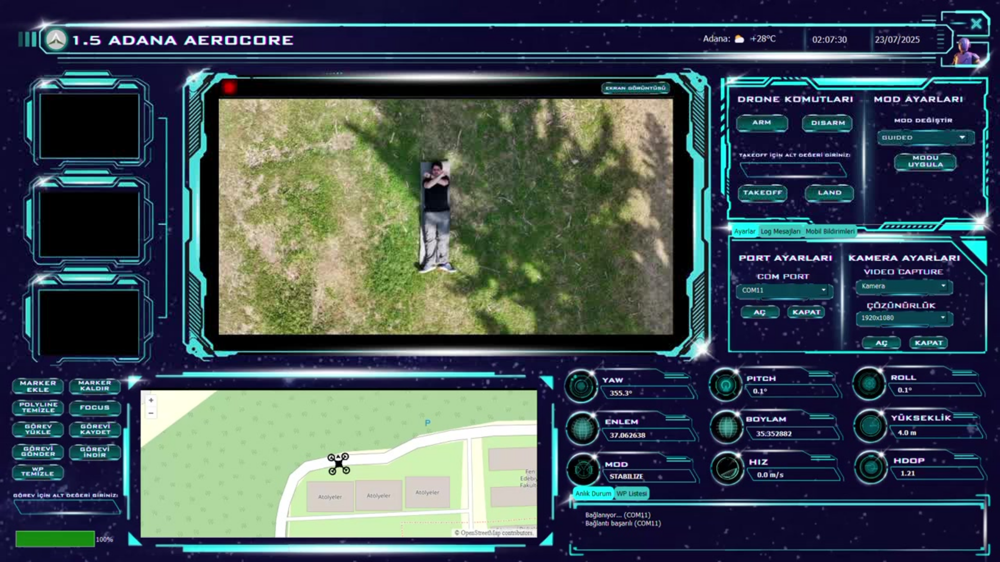
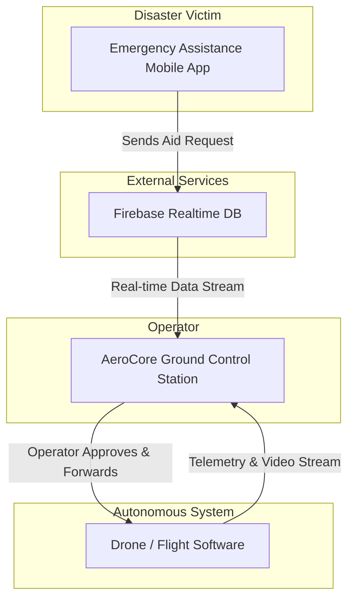

# AeroCore: Ground Control Station & Mission System for UAVs


This project was developed for the **Teknofest 2025 International UAV Competition, Free Mission Category**, where it was awarded **first place**.

The **AeroCore Ground Control Station (GCS)** is the central mission system designed for **real-time monitoring, operator-driven dynamic tasking, and AI-assisted video analysis** in humanitarian UAV missions.
It operates as the bridge between the **drone**, the **pose estimation pipeline**, and the **emergency assistance mobile app**.

---

### Aerocore Interface



---

### 🚀 Core Capabilities

* **Real-Time Monitoring & Tracking:** Visualization of UAV telemetry and video streams, ensuring situational awareness for the operator.
* **Mobile Assistance Requests:** Dynamic mission requests created by field personnel via the mobile app are streamed through Firebase. AeroCore displays them in real time, allowing the operator to **review, approve, and forward** them to the UAV.
* **Operator-Centric Task Management:** AeroCore pauses the ongoing autonomous mission, redirects the UAV to the approved target, and resumes the mission flow. Safety and human oversight are central.
* **High-Performance Video & AI Processing:** AI inference (YOLOv8, MediaPipe) and video decoding run in isolated worker processes with `multiprocessing`, ensuring the PyQt5 UI remains responsive.
* **Modular & Testable Architecture:** Built with **Hexagonal Architecture (Ports & Adapters)** and **MVC UI structure**, separating GCSCore (mission logic), CameraCore (video/AI), and technology adapters.
* **Custom-Built OpenCV:** OpenCV was **manually compiled with CUDA + GStreamer support**, enabling GPU-accelerated real-time decoding and preprocessing of video streams.

---

### 🏗️ System Architecture

#### High-Level System Architecture



#### Backend (Hexagonal Pattern)

* **Cores:**

  * `GCSCore`: Handles mission logic, MAVLink communication, and Firebase integration.
  * `CameraCore`: Manages video pipelines, AI orchestration, and GStreamer streams.
* **Ports:** Abstract contracts (`IPyMavlinkPort`, `ILoggerPort`) that define how cores communicate with outside systems.
* **Adapters:** Implementations of ports (e.g., `PymavlinkAdapter`, `OpenCVAdapter`). All tech-specific code resides here.
* **Shared Components:** `LoggerAdapter` (centralized logging), `CommandFactory`, `MessageParser`.

#### UI Layer (MVC Pattern)

* **Model:** State & business logic (GCSCore, CameraCore).
* **View:** Qt Designer–based `Ui_MainWindow`, fully visual, no logic.
* **Controller:**

  * `MainWindow`: Orchestrator that routes events between Model & View.
  * Specialized controllers (`ConnectionController`, `MapController`, `TelemetryController`, etc.), each focused on a single role.

---

### 💻 Technology Stack

* **Language:** Python
* **UI Framework:** PyQt5 (5.15.11)
* **AI & Computer Vision:** OpenCV **(custom build: CUDA + GStreamer)**, Ultralytics YOLOv8, Google MediaPipe, PyTorch (CUDA 11.8)
* **Communication & Data:** Pymavlink, Firebase Admin SDK, Pydantic
* **Async Processing:** multiprocessing, threading

---

### 🛠️ Setup and Installation

#### Prerequisites

* Python 3.9+
* Conda or another virtual environment manager
* GStreamer 1.x (MSVC 64-bit) — must be installed with complete Installation
* - **OpenCV (custom build with CUDA + GStreamer)**
  - **On NVIDIA Jetson:** _Manually compiled_ with CUDA + GStreamer for **better real-time performance** (GPU-accelerated decode & preprocessing)
  - **On Desktop (optional):** Prefer CUDA-enabled OpenCV build if a compatible NVIDIA GPU is available
- **NVIDIA GPU Acceleration**
  - NVIDIA GPU with CUDA Toolkit 11.8+ (optional, but recommended for hardware acceleration)

#### Installation

Clone this repository:

```bash
git clone https://github.com/sudekirlar/gcs_v1.2.git
cd gcs_v1.2
```

Install dependencies:

```bash
pip install -r requirements.txt
```

#### Configuration

Update the connection settings in:

```bash
config/settings.py
```

* Telemetry port (`COMx` or `tcp:127.0.0.1:5760`)
* Baud rate / TCP settings for SITL or real UAV

#### Running the Application

```bash
python main.py
```

---

## 👥 Developers

* **Sude Kırlar**
* **İlayda Demir**
